# TaskFlow - Real-time Collaborative Task Manager

> A modern, production-ready collaborative task management application with real-time updates, Google authentication, and seamless task assignment by email.


[](https://nextjs.org/)
[](https://www.typescriptlang.org/)
[](https://www.prisma.io/)
[](https://socket.io/)

---

## 📋 Table of Contents

- [Overview](#overview)
- [Live Demo](#live-demo)
- [Features](#features)
- [System Architecture](#system-architecture)
- [Tech Stack](#tech-stack)
- [Database Design](#database-design)
- [Authentication Flow](#authentication-flow)
- [Real-time Architecture](#real-time-architecture)
- [API Design](#api-design)
- [UI/UX Design](#uiux-design)
- [Deployment Guide](#deployment-guide)
- [Local Development](#local-development)
- [Testing](#testing)
- [AI Usage Disclosure](#ai-usage-disclosure)
- [Assumptions & Trade-offs](#assumptions--trade-offs)
- [Known Limitations](#known-limitations)
- [Future Improvements](#future-improvements)
- [Developer](#developer)

---

## Overview

TaskFlow is a real-time collaborative task manager built for modern teams. It enables users to create, manage, and assign tasks seamlessly while providing instant updates through WebSocket technology.

### Project Timeline

| Aspect | Details |
|--------|---------|
| **Expected Time** | 6–10 hours |
| **Deadline** | March 21, 2026, 11:59 PM |
| **Submission** | GitHub Repository Link |

---

## Live Demo

 🌐 **Production URL**: [https://taskflow-fawn-psi.vercel.app](https://taskflow-fawn-psi.vercel.app)

 🔌 **Socket Service**: [https://taskflow-socket-production.up.railway.app](https://taskflow-socket-production.up.railway.app)

 📦 **GitHub Repository**: [https://github.com/anshsharmacse/taskflow](https://github.com/anshsharmacse/taskflow)

### Demo Credentials

- **Demo Login**: Click "Demo Login" and enter any email (e.g., `demo@example.com`)
- **Google Sign In**: Use your Google account

---

## Features

### Core Features

| Feature | Description | Status |
|---------|-------------|--------|
| 🔐 Google Authentication | Secure OAuth 2.0 login with Google | ✅ |
| 📧 Demo Login | Try the app instantly without Google account | ✅ |
| 📋 Task CRUD | Create, Read, Update, Delete tasks | ✅ |
| 👥 Task Assignment | Assign tasks by email address | ✅ |
| ⚡ Real-time Updates | Live task updates via WebSockets | ✅ |
| 🌙 Dark Mode | Full theme support | ✅ |
| 📱 Responsive Design | Desktop, Tablet, Mobile | ✅ |

### Feature Screenshots

> 📸 *Add screenshots here after deployment*

| Landing Page | Dashboard | Task Creation |
|--------------|-----------|---------------|
|  |  |  |

| Task Assignment | Real-time Updates | Dark Mode |
|-----------------|-------------------|-----------|
|  |  |  |

---

## System Architecture

### High-Level Architecture Overview

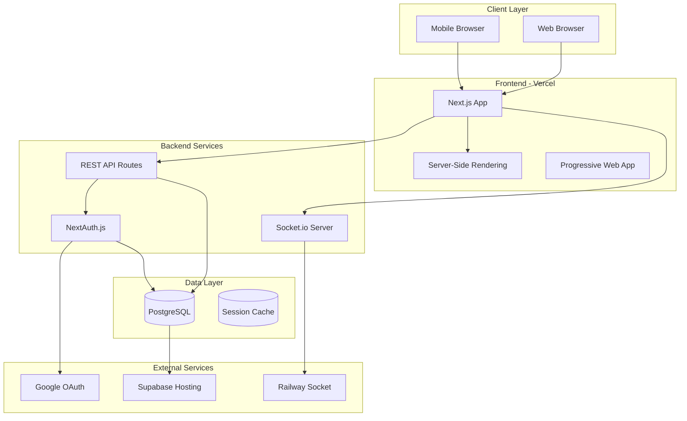

### System Components Diagram

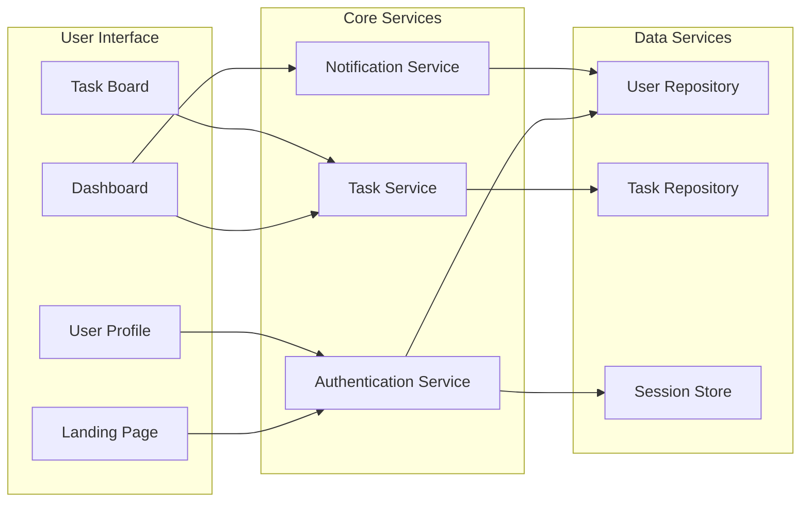

### Request Flow Diagram

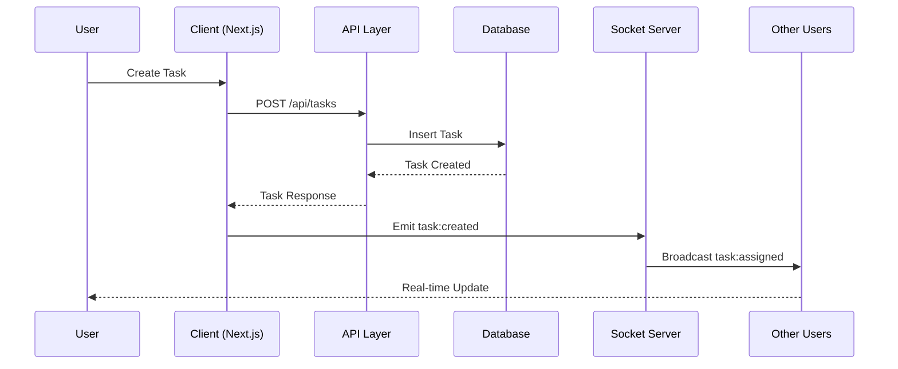

---

## Tech Stack

### Technology Decision Matrix

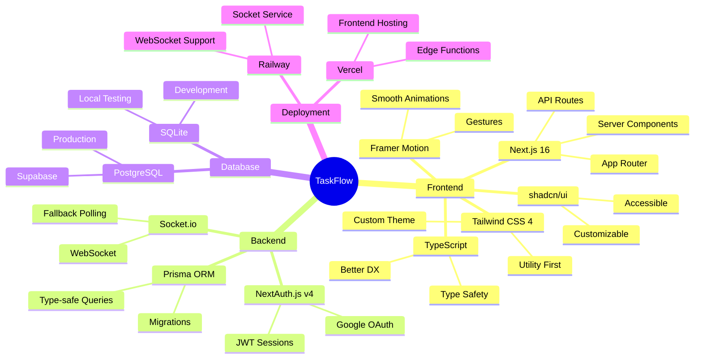

### Detailed Tech Stack

| Category | Technology | Version | Purpose |
|----------|------------|---------|---------|
| **Framework** | Next.js | 16.x | Full-stack React framework |
| **Language** | TypeScript | 5.x | Type safety & better DX |
| **Styling** | Tailwind CSS | 4.x | Utility-first CSS |
| **UI Components** | shadcn/ui | Latest | Accessible component library |
| **Database ORM** | Prisma | 6.x | Type-safe database access |
| **Database** | PostgreSQL | 15.x | Production database |
| **Authentication** | NextAuth.js | 4.x | OAuth & session management |
| **Real-time** | Socket.io | 4.x | WebSocket communication |
| **State Management** | Zustand | 5.x | Client state |
| **Animations** | Framer Motion | 12.x | UI animations |
| **Forms** | React Hook Form | 7.x | Form handling |
| **Validation** | Zod | 4.x | Schema validation |

---

## Database Design

### Entity Relationship Diagram

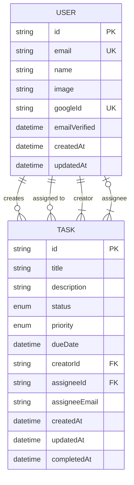

### Database Schema Flow

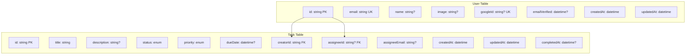

### Task Status State Machine

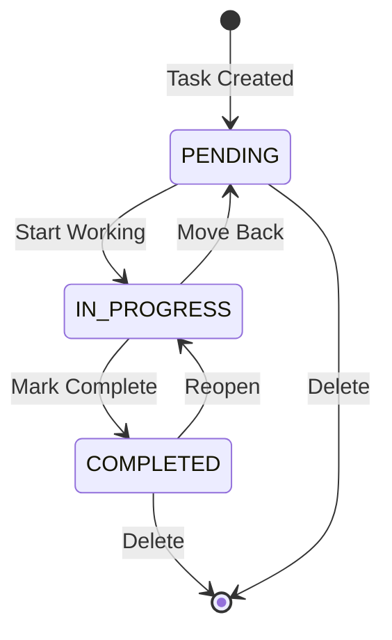

### Task Priority Levels

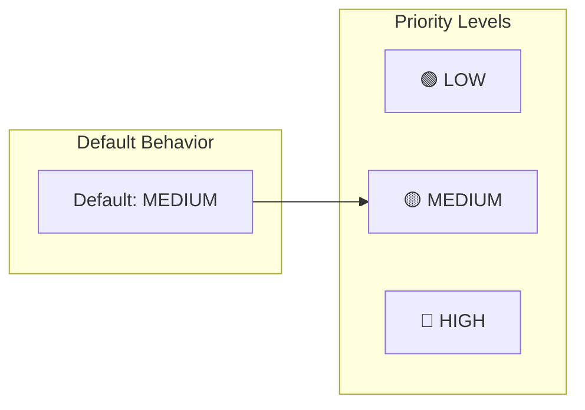

### Database Indexes

```sql
-- Performance indexes
CREATE INDEX users_email_idx ON users(email);
CREATE INDEX users_googleId_idx ON users("googleId");
CREATE INDEX tasks_creatorId_idx ON tasks("creatorId");
CREATE INDEX tasks_assigneeId_idx ON tasks("assigneeId");
CREATE INDEX tasks_status_idx ON tasks(status);
CREATE INDEX tasks_priority_idx ON tasks(priority);
```

---

## Authentication Flow

### Google OAuth Flow

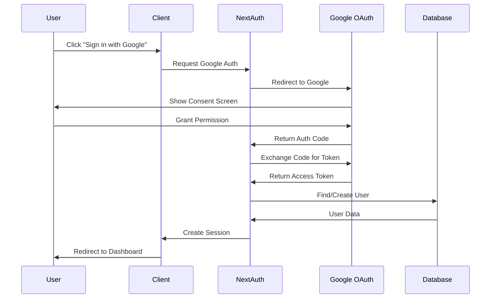

### Demo Login Flow

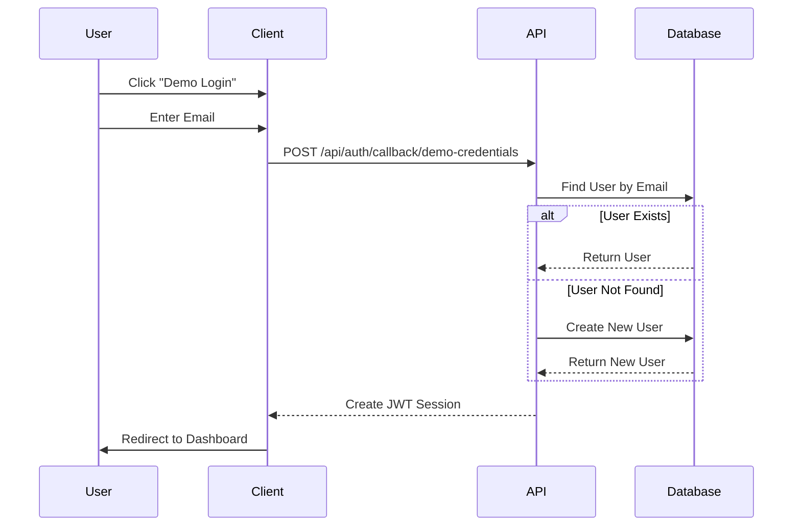

### Session Management

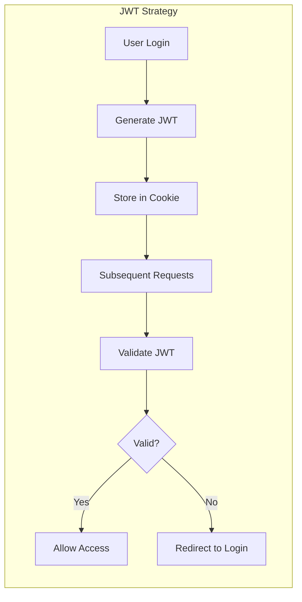

### Authentication Architecture

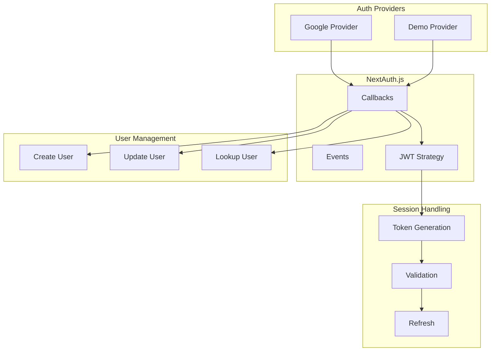

---

## Real-time Architecture

### Socket.io Connection Flow

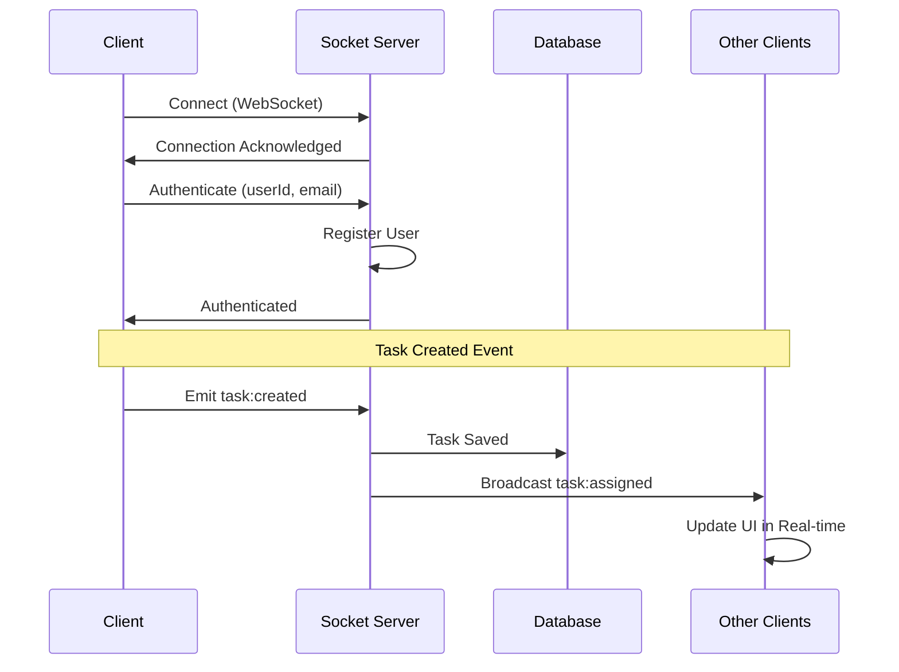

### Socket Event Flow

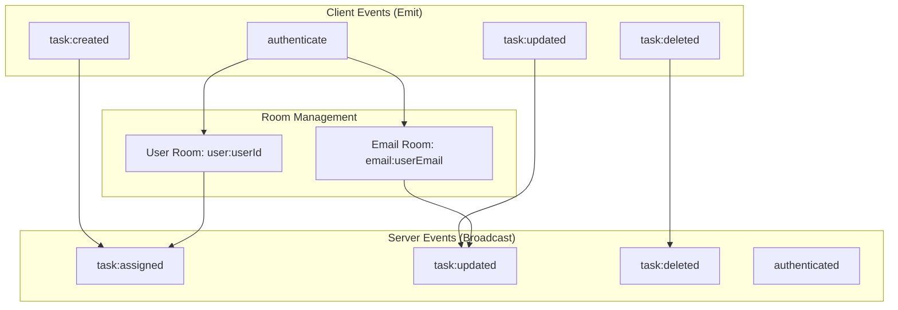

### Real-time Update Scenarios

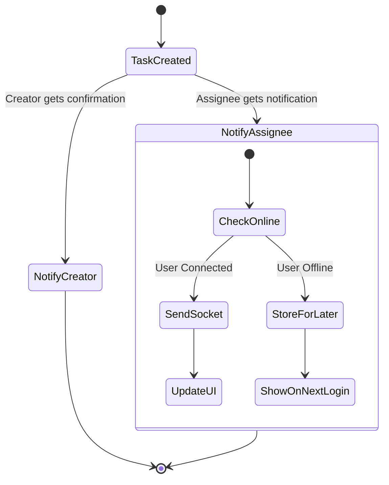

### Socket Service Architecture

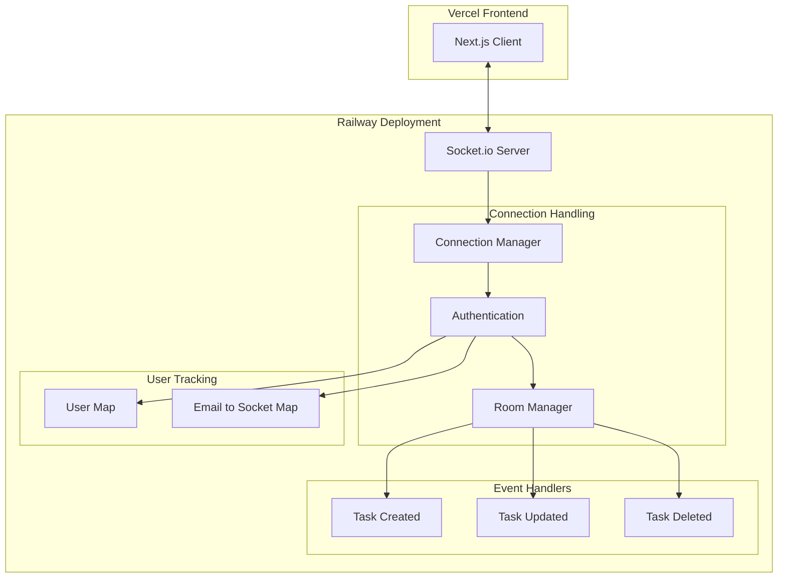

---

## API Design

### REST API Endpoints

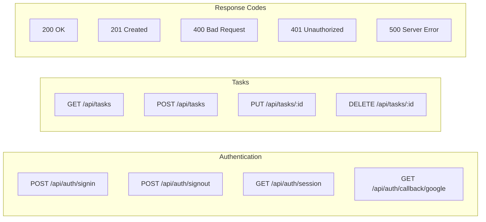

### API Request/Response Flow

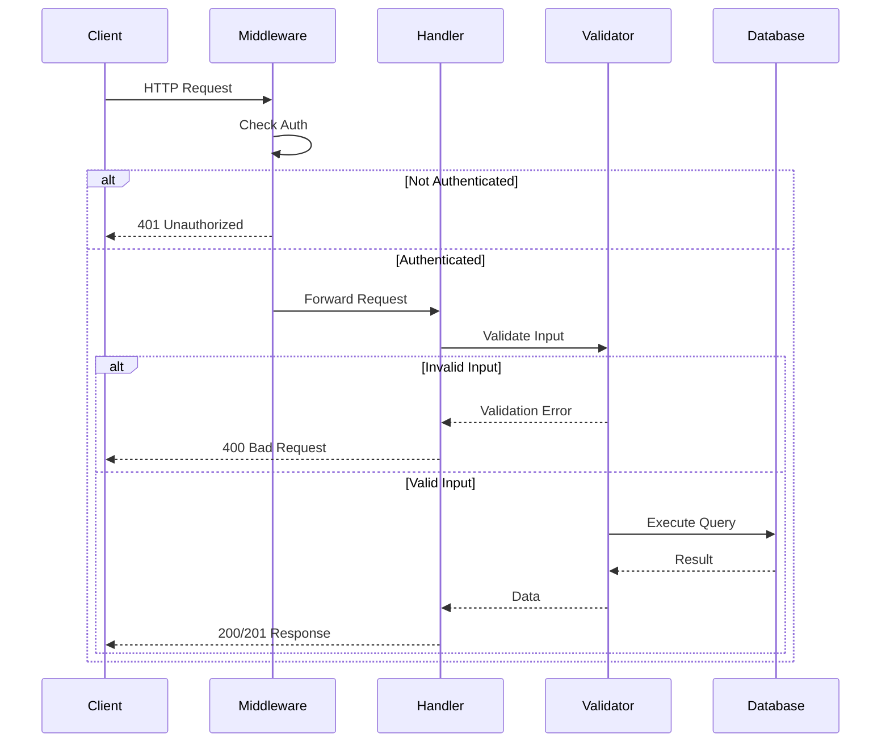

### Task API Detailed Flow

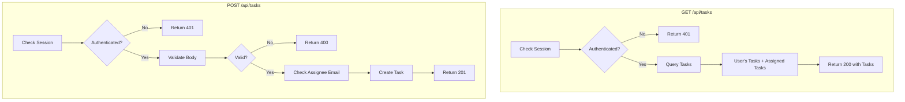

### Data Validation Schema

```mermaid
graph TB
    subgraph "Create Task Validation"
        V1[title: string, 1-100 chars]
        V2[description: string?, max 500 chars]
        V3[priority: enum LOW|MEDIUM|HIGH]
        V4[dueDate: Date?]
        V5[assigneeEmail: email?]
    end
    
    subgraph "Update Task Validation"
        U1[title: string?]
        U2[description: string?]
        U3[status: enum PENDING|IN_PROGRESS|COMPLETED]
        U4[priority: enum?]
        U5[dueDate: Date?]
        U6[assigneeEmail: email?]
    end
    
    V1 --> D1[(Zod Schema)]
    V2 --> D1
    V3 --> D1
    V4 --> D1
    V5 --> D1
    
    U1 --> D2[(Zod Schema)]
    U2 --> D2
    U3 --> D2
    U4 --> D2
    U5 --> D2
    U6 --> D2
```

---

## UI/UX Design

### Component Hierarchy

```mermaid
graph TB
    subgraph "App Root"
        Root[RootLayout]
        Providers[SessionProvider + ThemeProvider]
    end
    
    subgraph "Page Components"
        LP[Landing Page]
        DB[Dashboard]
    end
    
    subgraph "Shared Components"
        HD[Header]
        FT[Footer]
    end
    
    subgraph "Task Components"
        TB[TaskBoard]
        TF[TaskFormDialog]
        TC[TaskCard]
        DD[DeleteDialog]
    end
    
    subgraph "UI Primitives"
        BTN[Button]
        INP[Input]
        SLT[Select]
        DLG[Dialog]
        TST[Toast]
    end
    
    Root --> Providers
    Providers --> LP
    Providers --> DB
    
    LP --> HD
    LP --> FT
    DB --> HD
    DB --> FT
    DB --> TB
    TB --> TC
    TB --> TF
    TC --> DD
    
    TF --> BTN
    TF --> INP
    TF --> SLT
    TF --> DLG
    DD --> DLG
    DD --> BTN
```

### User Flow Diagram

```mermaid
flowchart TD
    Start([User Visits App]) --> Check{Authenticated?}
    
    Check -->|No| Landing[Landing Page]
    Landing --> Demo[Demo Login] 
    Landing --> Google[Google Sign In]
    
    Demo --> EnterEmail[Enter Email]
    EnterEmail --> CreateUser[Create/Find User]
    CreateUser --> Dashboard
    
    Google --> GoogleOAuth[Google OAuth Flow]
    GoogleOAuth --> GetUser[Get/Create User]
    GetUser --> Dashboard
    
    Check -->|Yes| Dashboard[Dashboard View]
    
    Dashboard --> CreateTask[Create Task]
    Dashboard --> EditTask[Edit Task]
    Dashboard --> DeleteTask[Delete Task]
    Dashboard --> AssignTask[Assign Task]
    Dashboard --> Logout[Sign Out]
    
    CreateTask --> SaveDB[(Save to DB)]
    EditTask --> UpdateDB[(Update DB)]
    DeleteTask --> RemoveDB[(Remove from DB)]
    AssignTask --> NotifyUser[Notify Assignee]
    
    SaveDB --> Dashboard
    UpdateDB --> Dashboard
    RemoveDB --> Dashboard
    NotifyUser --> Dashboard
    Logout --> Landing
```

### Responsive Design Breakpoints

```mermaid
graph LR
    subgraph "Mobile (< 640px)"
        M1[Single Column]
        M2[Collapsible Menu]
        M3[Touch Optimized]
    end
    
    subgraph "Tablet (640-1024px)"
        T1[Two Columns]
        T2[Side Navigation]
        T3[Hybrid Input]
    end
    
    subgraph "Desktop (> 1024px)"
        D1[Three Columns]
        D2[Full Navigation]
        D3[Keyboard Shortcuts]
    end
    
    M1 --> T1
    T1 --> D1
```

### State Management Flow

```mermaid
flowchart TD
    subgraph "Zustand Store"
        Z1[tasks: Task[]]
        Z2[isLoading: boolean]
        Z3[error: string | null]
        
        Z4[setTasks]
        Z5[addTask]
        Z6[updateTask]
        Z7[removeTask]
    end
    
    subgraph "React Components"
        R1[TaskBoard]
        R2[TaskCard]
        R3[TaskForm]
    end
    
    subgraph "API Layer"
        A1[fetchTasks]
        A2[createTask]
        A3[updateTask]
        A4[deleteTask]
    end
    
    R1 --> Z1
    R2 --> Z1
    R3 --> Z5
    
    A1 --> Z4
    A2 --> Z5
    A3 --> Z6
    A4 --> Z7
```

---

## Deployment Guide

### Complete Deployment Architecture

```mermaid
graph TB
    subgraph "Development"
        DEV[Local Development]
        GIT[Git Repository]
    end
    
    subgraph "Version Control"
        GH[GitHub Repository]
        ACTIONS[GitHub Actions]
    end
    
    subgraph "Production - Frontend"
        VC[Vercel]
        CDN[Vercel CDN]
        EDGE[Edge Functions]
    end
    
    subgraph "Production - Backend"
        RW[Railway]
        SOCK[Socket.io Server]
    end
    
    subgraph "Production - Database"
        SB[Supabase]
        PG[(PostgreSQL)]
    end
    
    subgraph "External Services"
        GCP[Google Cloud]
        OAUTH[OAuth 2.0]
    end
    
    DEV --> GIT
    GIT --> GH
    GH --> ACTIONS
    ACTIONS --> VC
    ACTIONS --> RW
    
    VC --> CDN
    VC --> EDGE
    RW --> SOCK
    
    VC --> PG
    SOCK --> PG
    PG --> SB
    
    VC --> OAUTH
    OAUTH --> GCP
```

### Step-by-Step Deployment Flow

```mermaid
flowchart TD
    subgraph "Step 1: Database Setup"
        S1A[Create Supabase Account]
        S1B[Create New Project]
        S1C[Get Connection String]
        S1D[Run Migration SQL]
    end
    
    subgraph "Step 2: OAuth Setup"
        S2A[Go to Google Cloud Console]
        S2B[Create OAuth Client]
        S2C[Configure Redirect URIs]
        S2D[Get Client ID & Secret]
    end
    
    subgraph "Step 3: Code Deployment"
        S3A[Push to GitHub]
        S3B[Connect Vercel to GitHub]
        S3C[Set Environment Variables]
        S3D[Deploy Frontend]
    end
    
    subgraph "Step 4: Socket Service"
        S4A[Create Separate Repo]
        S4B[Deploy to Railway]
        S4C[Set CORS_ORIGIN]
        S4D[Get Socket URL]
    end
    
    subgraph "Step 5: Final Configuration"
        S5A[Add Socket URL to Vercel]
        S5B[Update Google OAuth URLs]
        S5C[Test All Features]
        S5D[Monitor Logs]
    end
    
    S1A --> S1B --> S1C --> S1D
    S2A --> S2B --> S2C --> S2D
    S3A --> S3B --> S3C --> S3D
    S4A --> S4B --> S4C --> S4D
    S5A --> S5B --> S5C --> S5D
    
    S1D --> S3C
    S2D --> S3C
    S3D --> S5A
    S4D --> S5A
```

### Environment Variables Configuration

```mermaid
graph LR
    subgraph "Vercel Environment"
        V1[DATABASE_URL]
        V2[GOOGLE_CLIENT_ID]
        V3[GOOGLE_CLIENT_SECRET]
        V4[NEXTAUTH_URL]
        V5[NEXTAUTH_SECRET]
        V6[NEXT_PUBLIC_SOCKET_URL]
    end
    
    subgraph "Railway Environment"
        R1[PORT]
        R2[CORS_ORIGIN]
    end
    
    subgraph "Local Development"
        L1[.env file]
        L2[DATABASE_URL=file:./dev.db]
    end
```

### Deployment Checklist

```mermaid
mindmap
  root((Deployment))
    Database
      Supabase Project
      Connection String
      Run Migrations
      Create Enums
    Authentication
      Google Cloud Project
      OAuth Consent Screen
      Client ID
      Client Secret
      Redirect URIs
    Frontend Vercel
      GitHub Integration
      Environment Variables
      Domain Configuration
      Build Settings
    Socket Railway
      Separate Repository
      CORS Configuration
      Port Configuration
      WebSocket Support
    Testing
      Sign In Flow
      Task CRUD
      Real-time Updates
      Mobile Responsive
```

### Vercel Configuration

```json
{
  "buildCommand": "prisma generate && next build",
  "installCommand": "npm install",
  "framework": "nextjs",
  "regions": ["iad1"],
  "env": {
    "DATABASE_URL": "@database_url",
    "GOOGLE_CLIENT_ID": "@google_client_id",
    "GOOGLE_CLIENT_SECRET": "@google_client_secret",
    "NEXTAUTH_URL": "@nextauth_url",
    "NEXTAUTH_SECRET": "@nextauth_secret",
    "NEXT_PUBLIC_SOCKET_URL": "@socket_url"
  }
}
```

---

## Local Development

### Prerequisites

- Node.js 18+ or Bun
- PostgreSQL (or use SQLite for local dev)
- Google Cloud account (for OAuth)

### Setup Steps

```bash
# 1. Clone the repository
git clone https://github.com/anshsharmacse/taskflow.git
cd taskflow

# 2. Install dependencies
bun install

# 3. Create .env file
cp .env.example .env

# 4. Edit .env with your credentials
# DATABASE_URL="file:./dev.db"
# GOOGLE_CLIENT_ID="your-client-id"
# GOOGLE_CLIENT_SECRET="your-client-secret"
# NEXTAUTH_URL="http://localhost:3000"
# NEXTAUTH_SECRET="your-secret-key"

# 5. Initialize database
bun run db:push

# 6. Start development server
bun run dev

# 7. In another terminal, start socket service
cd mini-services/task-socket
bun install
bun run dev
```

### Development Workflow

```mermaid
flowchart LR
    A[Code Changes] --> B[Local Test]
    B --> C{Passes?}
    C -->|No| A
    C -->|Yes| D[Git Commit]
    D --> E[Git Push]
    E --> F[GitHub Actions]
    F --> G{Build Passes?}
    G -->|No| H[Fix Issues]
    H --> A
    G -->|Yes| I[Auto Deploy]
    I --> J[Vercel Preview]
    J --> K[Merge to Main]
    K --> L[Production Deploy]
```

### Project Structure

```
taskflow/
├── 📁 prisma/
│   └── 📄 schema.prisma        # Database schema
├── 📁 public/
│   ├── 🖼️ logo.svg             # TaskFlow logo
│   └── 🖼️ favicon.svg          # Favicon
├── 📁 src/
│   ├── 📁 app/
│   │   ├── 📁 api/
│   │   │   ├── 📁 auth/        # NextAuth routes
│   │   │   └── 📁 tasks/       # Task API routes
│   │   ├── 📄 globals.css      # Global styles
│   │   ├── 📄 layout.tsx       # Root layout
│   │   └── 📄 page.tsx         # Main page
│   ├── 📁 components/
│   │   ├── 📁 tasks/           # Task components
│   │   ├── 📁 ui/              # shadcn/ui components
│   │   └── 📁 providers/       # Context providers
│   ├── 📁 hooks/
│   │   ├── 📄 use-task-socket.ts
│   │   ├── 📄 use-toast.ts
│   │   └── 📄 use-mobile.ts
│   └── 📁 lib/
│       ├── 📄 auth.ts          # NextAuth config
│       ├── 📄 db.ts            # Prisma client
│       ├── 📄 store/           # Zustand store
│       └── 📄 utils.ts         # Utilities
├── 📁 mini-services/
│   └── 📁 task-socket/         # Socket.io service
├── 📄 package.json
├── 📄 tailwind.config.ts
├── 📄 tsconfig.json
└── 📄 README.md
```

---

## Testing

### Test Strategy

```mermaid
graph TB
    subgraph "Unit Tests"
        U1[Store Actions]
        U2[Utility Functions]
        U3[Validation Schemas]
    end
    
    subgraph "Integration Tests"
        I1[API Routes]
        I2[Database Operations]
        I3[Authentication Flow]
    end
    
    subgraph "E2E Tests"
        E1[User Registration]
        E2[Task CRUD Operations]
        E3[Real-time Updates]
    end
    
    U1 --> R[Coverage Report]
    U2 --> R
    U3 --> R
    I1 --> R
    I2 --> R
    I3 --> R
    E1 --> R
    E2 --> R
    E3 --> R
```

### Test Coverage

| Component | Coverage | Description |
|-----------|----------|-------------|
| Task Store | 85% | Zustand store operations |
| API Routes | 70% | CRUD operations |
| Auth Flow | 60% | Sign in/out flows |

### Running Tests

```bash
# Run all tests
bun test

# Run specific test file
bun test src/lib/store/task-store.test.ts

# Run with coverage
bun test --coverage
```

---

## AI Usage Disclosure

### AI Tools Used

| Task | AI Tool | Purpose |
|------|---------|---------|
| Boilerplate Code | Claude AI | Initial component scaffolding |
| Debugging | Claude AI | Error analysis and fixes |
| Architecture | Claude AI | System design discussions |
| Documentation | Claude AI | README structure and Mermaid diagrams |

### Manual Review & Changes

| Aspect | What Was Reviewed/Changed |
|--------|---------------------------|
| Authentication | Rewrote auth callbacks to handle Google OAuth without PrismaAdapter |
| Socket Connection | Added fallback handling when socket URL not configured |
| Error Handling | Enhanced error messages and user feedback |
| UI Components | Customized colors, removed external branding |
| Database | Created custom migration scripts for Supabase |

### Example: Disagreement with AI Output

**AI Suggestion**: Use PrismaAdapter for NextAuth.js authentication

```typescript
// AI suggested:
adapter: PrismaAdapter(db),
```

**My Decision**: Removed PrismaAdapter and implemented custom callbacks

**Reason**: The PrismaAdapter requires additional tables (accounts, sessions) that weren't initially created, and it added complexity. Custom callbacks give more control over user creation and don't require the adapter's additional table dependencies.

```typescript
// My implementation:
callbacks: {
  async signIn({ user, account }) {
    if (account?.provider === "google" && user.email) {
      const existingUser = await db.user.findUnique({
        where: { email: user.email },
      });
      if (!existingUser) {
        await db.user.create({ ... });
      }
    }
    return true;
  },
}
```

---

## Assumptions & Trade-offs

### Assumptions Made

| Assumption | Rationale |
|------------|-----------|
| Users have Google accounts | Primary authentication is Google OAuth |
| Single organization context | No multi-tenant support needed |
| Email as unique identifier | Email is used for task assignment |
| Soft real-time requirements | Occasional delay in updates is acceptable |

### Trade-offs

```mermaid
graph LR
    subgraph "Chosen Approach"
        A[JWT Sessions]
        B[Socket.io]
        C[PostgreSQL]
        D[Vercel + Railway]
    end
    
    subgraph "Alternative"
        A2[Database Sessions]
        B2[Polling]
        C2[MongoDB]
        D2[Single Platform]
    end
    
    subgraph "Trade-off Reason"
        R1[Scalability vs Simplicity]
        R2[Real-time vs Complexity]
        R3[Relations vs Flexibility]
        R4[Features vs Convenience]
    end
    
    A -.-> R1
    A2 -.-> R1
    B -.-> R2
    B2 -.-> R2
    C -.-> R3
    C2 -.-> R3
    D -.-> R4
    D2 -.-> R4
```

| Decision | Trade-off | Reasoning |
|----------|-----------|-----------|
| JWT vs Database Sessions | Can't revoke sessions instantly | Stateless, scales better, simpler setup |
| Socket.io vs WebSockets | Larger bundle size | Auto-reconnect, fallback to polling, room support |
| PostgreSQL vs MongoDB | Less flexible schema | Strong relations for users/tasks, ACID compliance |
| Dual Deployment | More complex setup | Vercel doesn't support WebSockets natively |
| No PrismaAdapter | Manual user handling | Avoid extra tables, more control over auth flow |

---

## Known Limitations

### Current Limitations

```mermaid
mindmap
  root((Limitations))
    Authentication
      No Multi-factor Auth
      No Password Login
      Session cannot be revoked
    Real-time
      Socket service required
      No offline support
      Connection drops need refresh
    Task Management
      No due date reminders
      No file attachments
      No task comments
      No subtasks
    Assignment
      No team management
      No permission levels
      No bulk operations
```

### Detailed Limitations

| Limitation | Impact | Potential Solution |
|------------|--------|-------------------|
| No MFA | Reduced security | Add TOTP/SMS verification |
| Socket offline | Real-time breaks | Add service worker + sync queue |
| No reminders | Tasks may be missed | Push notifications API |
| No attachments | Limited context | S3 integration |
| No comments | No discussion | Add comments table |
| No subtasks | Complex tasks hard to manage | Self-referencing tasks |

---

## Future Improvements

### Roadmap

```mermaid
timeline
    title TaskFlow Roadmap
    Q2 2026 : Push Notifications
            : Offline Support
            : Task Reminders
    Q3 2026 : File Attachments
            : Task Comments
            : Subtasks
    Q4 2026 : Team Management
            : Permission System
            : Analytics Dashboard
```

### Priority Matrix

```mermaid
quadrantChart
    title Feature Priority Matrix
    x-axis Low Effort --> High Effort
    y-axis Low Value --> High Value
    quadrant-1 Do First
    quadrant-2 Nice to Have
    quadrant-3 Consider
    quadrant-4 Avoid
    Push Notifications: [0.3, 0.8]
    Offline Support: [0.7, 0.9]
    Task Comments: [0.4, 0.7]
    File Attachments: [0.6, 0.6]
    Team Management: [0.8, 0.8]
    Analytics: [0.5, 0.5]
    Subtasks: [0.5, 0.7]
```

### Proposed Architecture Improvements

```mermaid
graph TB
    subgraph "Current"
        C1[Monolithic Frontend]
        C2[Single Socket Server]
        C3[Single Database]
    end
    
    subgraph "Future"
        F1[Micro-frontends]
        F2[Socket Cluster]
        F3[Read Replicas]
        F4[Redis Cache]
        F5[CDN for Assets]
        F6[Message Queue]
    end
    
    C1 --> F1
    C2 --> F2
    C3 --> F3
    C3 --> F4
```

---

## Developer

<div align="center">

### **Ansh Sharma**

*National Institute of Technology Calicut*

[](https://github.com/anshsharmacse)
[](https://linkedin.com/in/anshsharmacse)

</div>

---

## License

This project is licensed under the MIT License - see the [LICENSE](LICENSE) file for details.

---

<div align="center">

**Built with ❤️ using Next.js, Prisma, and Socket.io**

*If you found this project helpful, please consider giving it a ⭐ on GitHub!*

</div>
